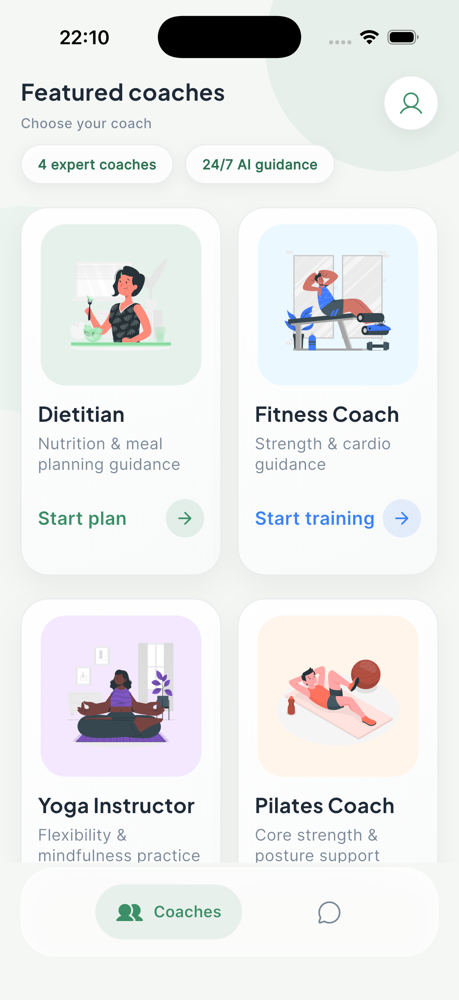
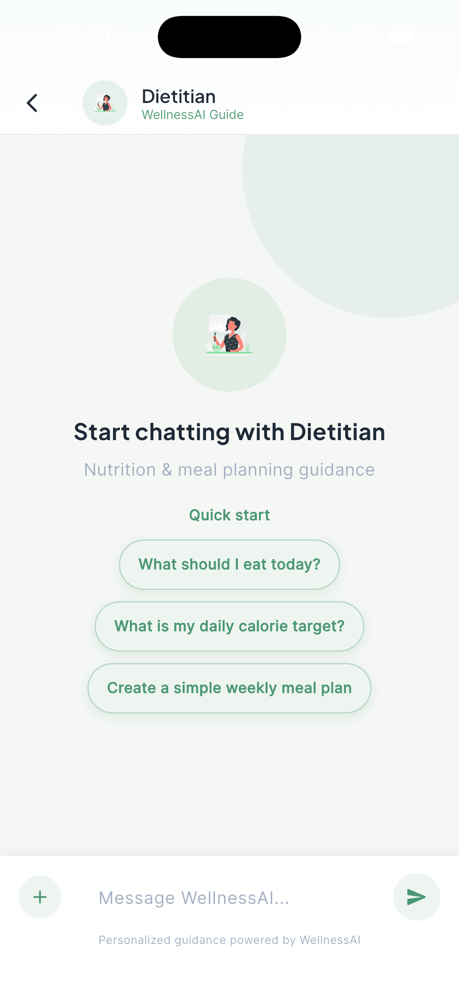
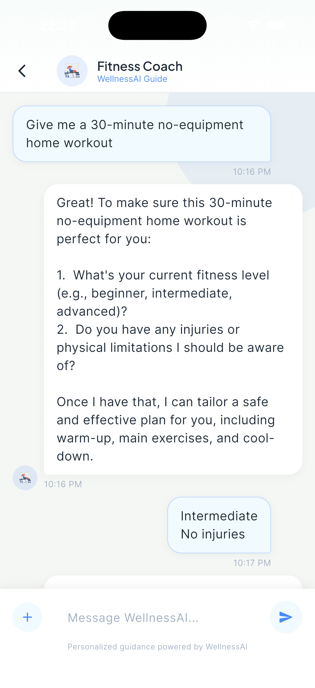
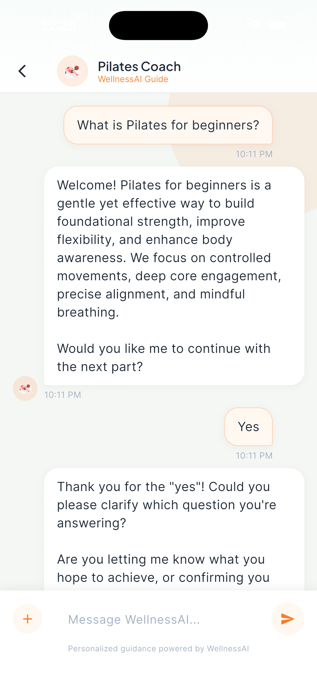
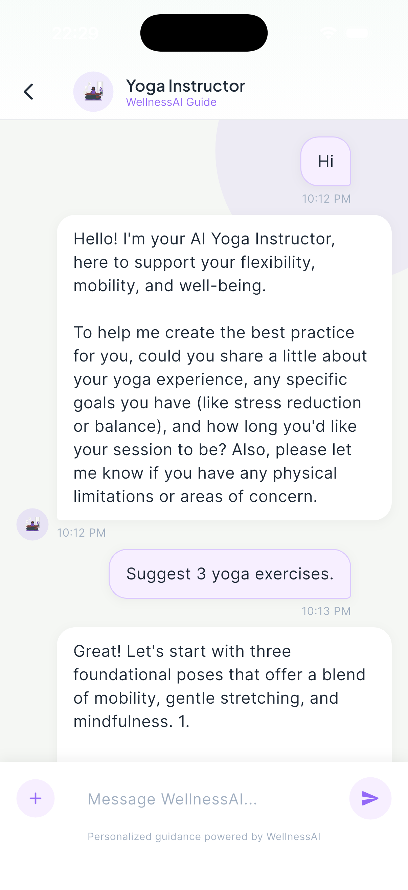
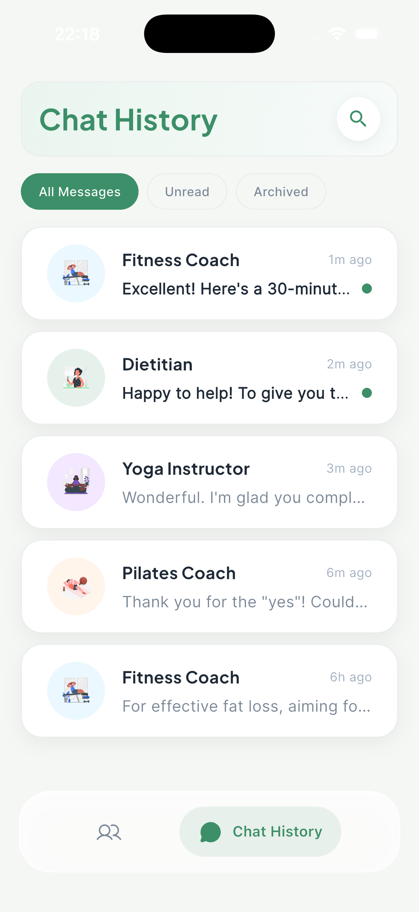

# WellnessAI - Flutter Academy Case Study

WellnessAI is a health and wellness mobile application where users can chat with AI coaches that have different areas of expertise.

## Project Scope

- Bottom navigation with two tabs:
   - Coaches (Home)
   - Chat History
- At least 4 AI coaches with dedicated chat flows:
   - Dietitian
   - Fitness Coach
   - Pilates Instructor
   - Yoga Teacher
- Dynamic personas for each coach using Firebase Remote Config system instructions
- AI responses generated through Firebase AI with system instruction injected at model initialization
- Local chat persistence and resume support from Chat History

## Tech Stack

- Flutter
- State Management: Cubit (`flutter_bloc`)
- Firebase Core
- Firebase Remote Config
- Firebase AI (`firebase_ai`)
- Local Storage: Hive
- Other utilities: `equatable`, `intl`, `uuid`

## Architecture

Feature-first and clean separation between UI and business logic.

```text
lib/
   app/
      theme/
   core/
      constants/
      models/
      services/
   features/
      coaches/
      chat/
      chat_history/
   navigation/
   main.dart
```

- UI is handled in view layer.
- State and business logic are managed by Cubits.
- Firebase and local persistence are abstracted through services.

## Firebase Setup

1. Create a Firebase project.
2. Enable Firebase Remote Config and Firebase AI.
3. Configure Android/iOS app identifiers.
4. Generate FlutterFire files locally:

```bash
dart pub global activate flutterfire_cli
flutterfire configure
```

5. Add and publish Remote Config keys:
    - `dietitian_system_instruction`
    - `fitness_coach_system_instruction`
    - `pilates_coach_system_instruction`
    - `yoga_guru_system_instruction`

Example value:
`You are a professional [ROLE] AI assistant. Keep responses concise, safe, and actionable.`

## Run

```bash
flutter pub get
flutter run
```

## Chat History Behavior

- Stores conversations locally on device.
- Shows coach name, timestamp, and last message snippet.
- Allows opening an existing session and continuing from previous context.

## Screenshots

### Home


### Coaches





### Chat History



